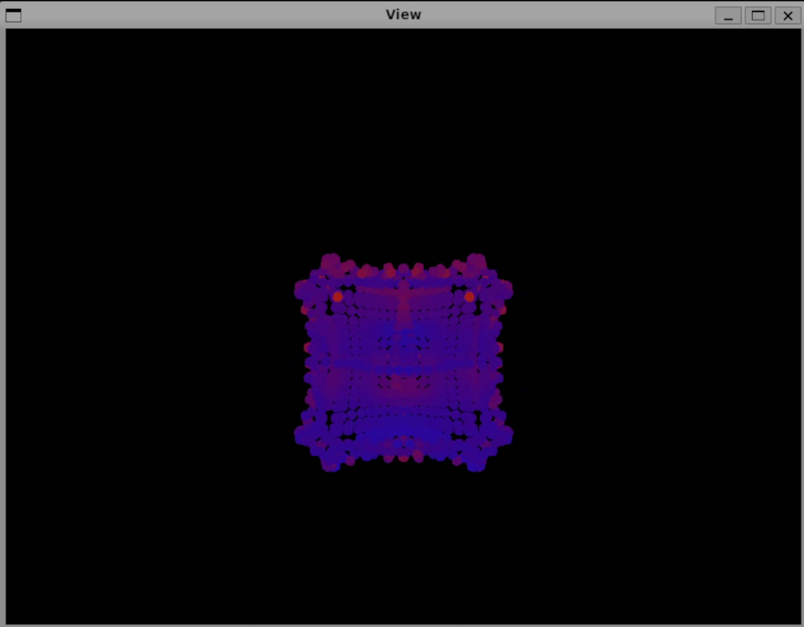
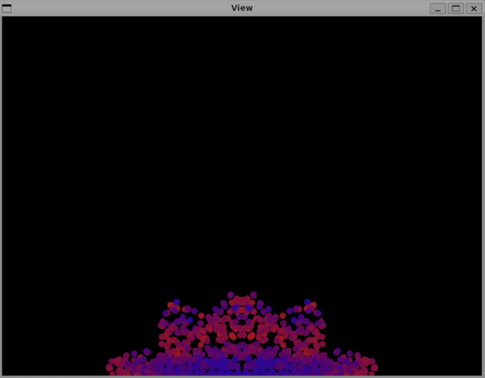
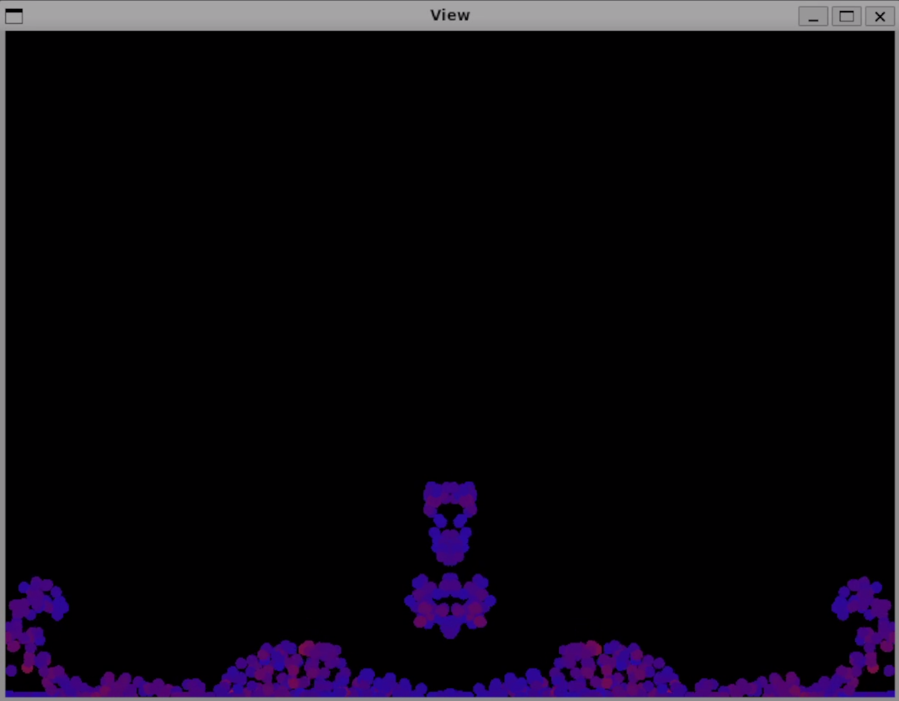
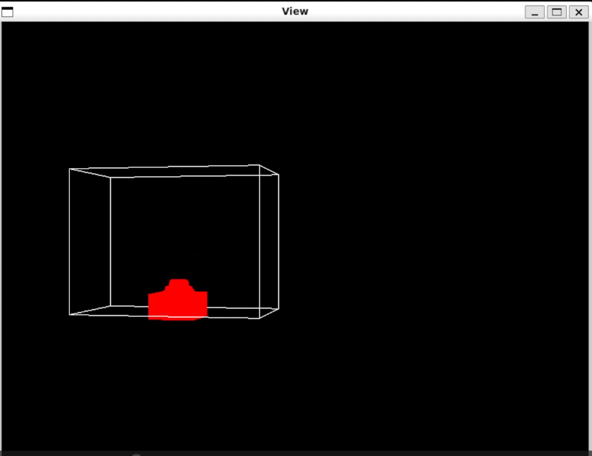
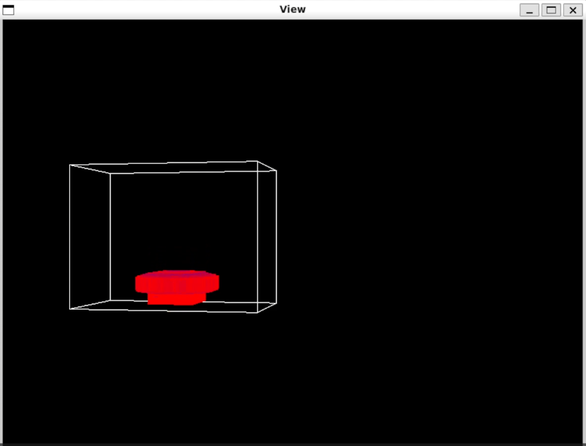
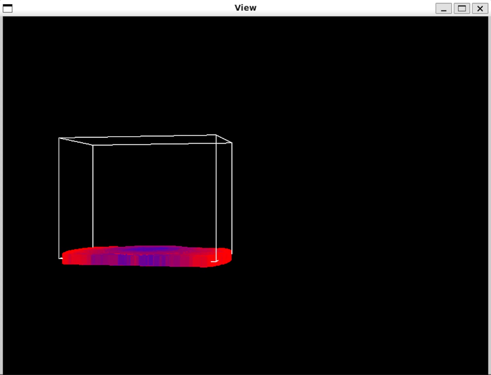

# 2D and 3D sph fluid simulations

## SPH Overview:
Smoothed Particle Hydrodynamic (SPH) fluid simulations are a method for simulating fluids with particles. This method simplifies the calculations by approximating the navier stokes equations through weighted approximations of density and pressure calculations among particles. Particles are given a radius of influence around them, where the weight is defined by a kernel. The kernel is determined such that the area or volume of the kernel is always one. This is required in order to achieve uniform density throughout the fluid. Because SPH calculations are only approximations, the simulations are very dependent on the kernel, along with other chosen parameters that are used to model reality such as the particle masses, target densities, and equation of state coefficients used for the pressure calculations. 

## Table of Contents
- [Project Description](#project-description)
  - [About The Code](#about-the-code)
  - [Technical Learnings](#technical-learnings)
  - [Workflow And Challenges](#workflow-and-challenges)
  - [The Open Bugs And Areas For Improvement](#the-open-bugs-and-areas-for-improvement)
- [Results](#results)
- [Building And Running The Code.](#building-and-running-the-code)
  - [Dependencies](#dependencies)
  - [Running the code](#running-the-code)
- [Summary](#summary)

## Project Description

### About The Code
This code is _very_ heavily inspired from [Doyub Kim's Fluid Engine Development book](https://doyub.com/fluid-engine-development/). Following along with the book and actually typing out the required classes for particle data, particle systems, and their extensions was an enlightening study of clean software engineering. I tried to take the code a step further by templating the classes so that they are dimension agnostic, allowing you to instantiate a 2D/3D particle system just by passing in the appropriate vector. `ParticleSystem<cato::Vec2d>` for a 2D particle system and `ParticleSystem<cato::Vec3d>` for a 3D vector system.

### Technical Learnings
What I came to appreciate most about the software structure is the seperation of data and simulation classes, along with the clear class heirarchy. The base class for the two solvers,`ParticleSystemSolver` and `SPHSystemSolver`, is `PhysicsAnimation`. I found it to be very clean how the flow of logic starts from the very basic problem of needing to animate a simulation, and builds upon that for each type of simulation. It lead to a very clear breakdown of what is required at each step, which can be clearly seen by the virtual classes in `PhysicsAnimation.cpp`. Although it only really gets defined in `ParticleSystemSolver::on_update()`. 

I also found the seperation of logic between the solver and data classes. The data classes `SPHSystemData` and `ParticleSystem` are responsible for determining data about the current state of the particles. You would think these classes could be simply data containers, but I found having constant functions that determine things such as neighboring particles or particle densities based on neighbors to be much more cleanly organized in the data classes as opposed to the solvers. I also found the tight coupling between the solver and data classes a solid design decision. Each solver class contains a pointer to their corresponding data class, highlighting that the solver cannot exist without the specific kind of data. This did cause some tricks with the templated inheritance, but we got around this with some `std::static_pointer_cast` and protected type specific constructors. 

### Workflow And Challenges
The real trick of the project was getting the simulation to be dimension agnostic. It was satisfying playing with 2D particles, but it seemed like far too much code duplication to create a 3D version of each of the classes. Even though there is some branching logic based on dimensionality, using compile time `constexpr` was able to account for this. This mostly occured in neighbor search algorithms, drawing the particles, or bounding the particles. The majority of the project was actually spent studying the code structure from the Fluid Engine Development book, and learning how to create templated classes in C++. The project actually started with just 2D particle system classes that were templated to take any base data type (ie float, double, etc). It remained this way until I was able to achieve some nice results with 2D simulations. 

I had much more success with the particles in 2D as opposed to 3D, but I found it amazing how much getting good results depended on sitting there and tuning the different paramters such as the mass, target density, equation of state exponent, or speed of sound (which is basically a pressure multiplier term). The most difficult part of the code was drawing the 3D border and particles. Getting the shader to load and compile was a bit of a nightmare, and I appologize for what you'll see is required in the `Building And Running The Code` section. But here are my other grievences and some open bugs. 


### The Open Bugs And Areas For Improvement
For the more interesting techincal side of things, getting the bounds of the simulation to be dimesnion agnostic (at least in the code) was not too bad. Although it leaves some things wanting. If we are to translate the region that the particles are bound in, we have to pass it a new `Box<VecType>`, which is either 2D/3D. This is fine and all, but the verts that you pass the box are what are used for the collision detection to keep the particles within a given area. If we just slap a model matrix onto the `Box`, then we can move the box with OpenGL at render time, but the simulation won't know about it. 

One approach could be to give the `Box` its own model matrix, which would allow the simulation to determine the bounds based off of the original `Box` local space modified by the model matrix. I think this would be an approach worth looking into. 

The other grievence I have with 3D is that my camera just refuses to work properly. This probably has something to do with my own implementation of a `Camera::look_at(...)` potentially not being sound, but it never seems to actually look at the origin when I move the camera on the y axis.

Another major struggle was getting the correct verts onto the GPU based on a typedefined cube. It probably would have been easier to tell OpenGL what type we were working with for the verts, but I ended up just casting all the verts to floats. Good enough to draw things. And it would have been nice to actually come up with an efficient representation for laying out the verts for a sphere. That's been on the to do list for ages, and would have helped the 3D simulation a lot instead of drawing the particles as cubes. 

And finally I don't believe I am rendering the particles efficiently in 3D. At the moment, particles are drawn in `SPHSystemSolver::update_graphics(...)` by looping over every particle, updating the shader uniform, then calling for the particle shape (which right now is just another `Box`) to draw. It seem woefully inneficient, but it's certainly better than the 3D version which falls back to legacy OpenGL. And the bottle neck is in the neighbor search anyway.

## Results
Here's an image of the best simulation I got in 2D. After dropping a ball of particles, it actually looked like the particles splashed back up into the air while the waves on the side crashed onto themselves after colliding with the walls:





The results in 3D were a little less dramatic. I was only able to make a very goopy looking fluid after cranking up particle mass and gravity, while driving down the target density. The simulation is also pretty slow in its current configuration, so some optimizations are required for better 3D results. 





Some good videso of the simulation can be found below:
1. [interactive 2D fluids](https://vimeo.com/1144029537?share=copy&fl=sv&fe=ci)
2. [Force propegations](https://vimeo.com/1144043974?share=copy&fl=sv&fe=ci)
2. [Unexpected Fractals](https://vimeo.com/1144030100?share=copy&fl=sv&fe=ci)
3. [The best 2D drop](https://vimeo.com/1144030326?share=copy&fl=sv&fe=ci)
4. [3D goop](https://vimeo.com/1144031595?share=copy&fl=sv&fe=ci)


## Building And Running The Code. 

### Dependencies
There weren't any dependencies until I moved to 3D. All I needed was code to compile and link the shaders, so I turned to [the starter code provided here](https://clemson.instructure.com/courses/264860/files?preview=28584625). It's a bit of a mess and I really wouldn't reccommend this, but at the moment it's required to run the sph simulation. You have to take the whole common folder and place it next to the folder for this project. So something like

```
|-simple-sph_sim
|    |-bin/include/shaders/src/etc
|
|- common
|    |- include/linuxi386/etc
```

The make file takes care of the rest. It's an awful hack and only exists so I can compile the shaders. 

### Running the code
To build the code, simply `make`, then `./bin/sph_sim [number_of_particles: int]`. As the program stands at the moment, the number of particles you pass in doesn't acctually affect anything. The particles are actually spawned in a grid, the code for which can be found in `main.cpp`. Once the simulation is running, press `c` to get a printout of the controls in order to adjust/toon the simulation for better results. I suggest increasing gravity to get the 3D simulation to work a bit better. And driving up the particle masses. 

Switching between 2D and 3D actually takes a bit of work at the moment, and making this process more seamless is on the to do list. But as of right now here's a basic run down of what needs to be done:

1. In `Model.h` Change the `SPHSystemSolver` to be either a `SPHSystemSolver2d` or `SPHsystemSolver3d`
2. In `Model.cpp` in the constuction function, uncomment the block for either a 2D/3D bounding box. 
3. In `Controller.cpp` swap out the box reset to 2D/3D when `r` is pressed
3. If you want to interact with the code, uncomment the relevant code in `Model.cpp:simulate()`


## Summary
Overall I found this project quite enjoyable. Physics based simulations are something I have been working up to for years, so It was very satisfying to actually take a deep dive into learning how they are built. I actually took a crack at this book about four years ago, but was not quite ready yet with my software experience to really appreciate and understand what all was going on. 
I still need to improve my planning when it comes to building or extending software. It would be worth the time to break down much of the required work to render 3D objects so that the 3D draws could be more seamlessly integrated into the solvers. But when it comes to the SPH simulation side of things, this was an excellent study of the approximations that go into mimmicking fluid flow. It's surprising just how sensitive the simulations are, and this has not even scratched the surface of what it takes to actually render the simulation to look like a fluid instead of a collection of particles. 
